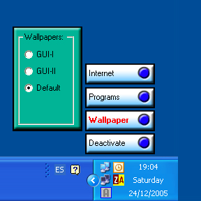



## Alpha Menu

### Description

Desktop menu with slide effects, expand, collapse, and popout menus. Copy and paste code to new forms to make as many levels of menu as you want.

Easy to customise with your own buttons, menus etc.

Wallpaper changer routine, program execution routine, play a wav sound file routine.

All "menu Items" sit over Desktop, can be made bigger/smaller, positioning easy to change. just change FormMain startup position
 
### More Info
 

             |
---                |---
**Submitted On**   |2005-12-22 01:20:26
**By**             |[Ian Platt](https://github.com/Planet-Source-Code/PSCIndex/blob/master/ByAuthor/ian-platt.md)
**Level**          |Intermediate
**User Rating**    |3.7 (11 globes from 3 users)
**Compatibility**  |VB 6\.0
**Category**       |[Custom Controls/ Forms/  Menus](https://github.com/Planet-Source-Code/PSCIndex/blob/master/ByCategory/custom-controls-forms-menus__1-4.md)
**World**          |[Visual Basic](https://github.com/Planet-Source-Code/PSCIndex/blob/master/ByWorld/visual-basic.md)
**Archive File**   |[Alpha\_Menu19596212242005\.zip](https://github.com/Planet-Source-Code/ian-platt-alpha-menu__1-63787/archive/master.zip)

